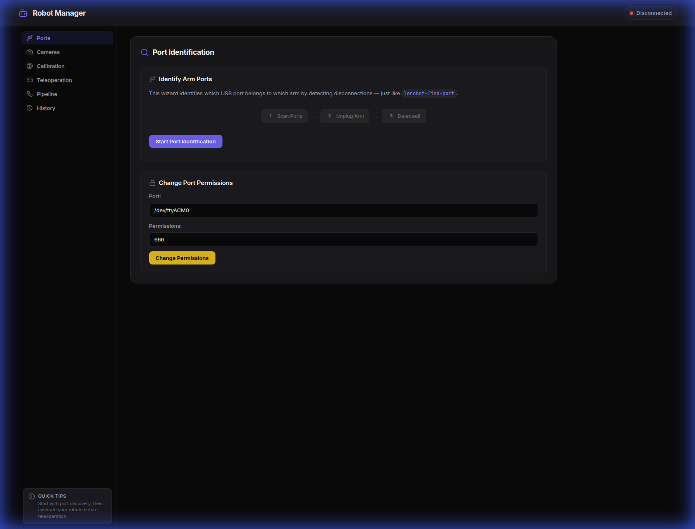
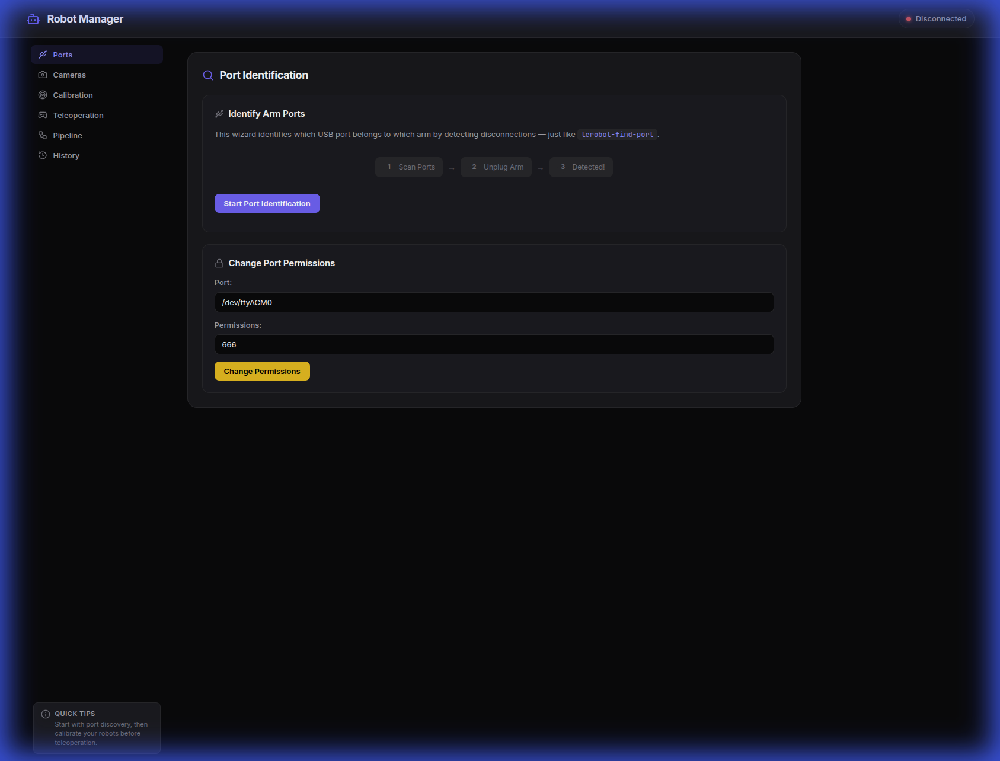
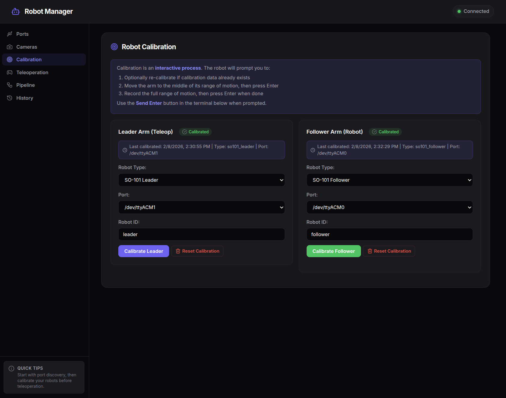
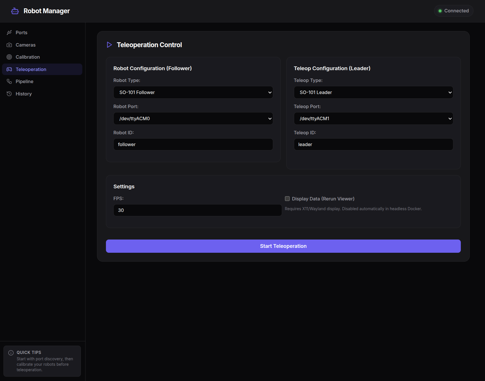
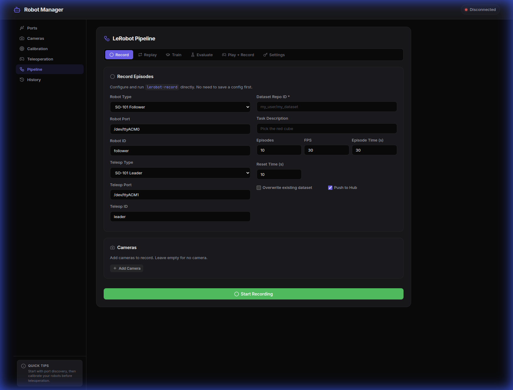

# Robot Manager

UI to manage the **LeRobot SO-101/SO-100** robotic arms.

Robot Manager is a full-stack application for controlling LeRobot hardware through an intuitive web interface. The system features a modular Python backend with FastAPI and a modern React TypeScript frontend with a tabbed interface.



## Key Features

### 🔌 Port Management
Easily identify and manage USB ports for your robotic arms. The wizard helps you detect which port belongs to which arm.


### ⚖️ Calibration
Interactive calibration process to ensure your robotic arms are perfectly synced and ready for action.


### 🎮 Teleoperation
Zero-latency teleoperation control for your leader and follower arms. Configure FPS and visualize data in real-time.


### 📁 Recording & Pipeline
Complete pipeline for recording episodes, replaying trajectories, and managing datasets directly from the UI.


## Architecture

### Backend Structure (Modular Design)

```
backend/
├── app/
│   ├── main.py                    # FastAPI application factory
│   ├── api/routes.py             # API endpoint handlers
│   ├── core/config.py             # Settings and configuration
│   ├── models/schemas.py            # Pydantic models
│   └── services/
│       ├── command_service.py    # Command execution logic
│       └── robot_service.py      # Robot-specific operations
└── main.py                        # Entry point
```

### Frontend Structure (Tabbed Interface)

```
frontend/
├── src/
│   ├── App.tsx                   # Main app with tab navigation
│   ├── App.css                   # Tabbed layout styles
│   ├── api/robotApi.ts          # Backend API client
│   └── components/              # UI components
```

## Quick Start

```bash
# Start both services
docker compose up --build 

# Backend: http://localhost:8000
# Frontend: http://localhost:5173
# API Docs: http://localhost:8000/docs
```